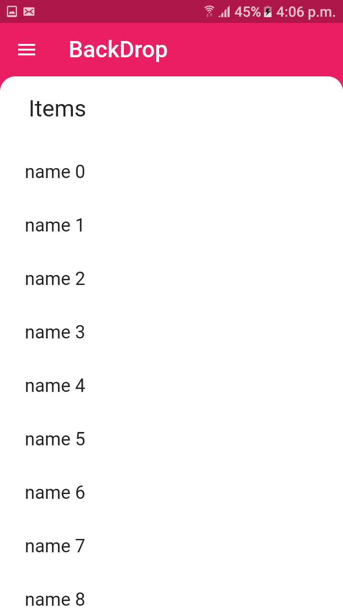

# Flutter BackDrop

Google Material Design BackDrop widget for Android and IOS

## Getting Started

Add the backdrop dependency to your pubspec.yaml file.

`backdrop: "^<version number>"`

then run flutter packages get to install the dependency.

## Images 

[First Page](asset/pic1.png)

[](asset/pic4.png)
[](asset/pic5.png)


## Example

```
import 'package:flutter/material.dart';
 import 'package:backdrop/backdrop.dart';
 
 class MyHomePage extends StatefulWidget {
   @override
   _MyHomePageState createState() => _MyHomePageState();
 }
 
 class _MyHomePageState extends State<MyHomePage> {
   @override
   Widget build(BuildContext context) {
     return Backdrop(
       subHeader: "Items",
       appBarTitle: "BackDrop",
       backLayer: ListView(
         children: <Widget>[
           ListTile(
             leading: Icon(
               Icons.map,
               color: Colors.white,
             ),
             title: Text(
               "Map",
               style: TextStyle(color: Colors.white),
             ),
             selected: true,
           ),
           ListTile(
             enabled: false,
             leading: Icon(Icons.directions_car),
             title: Text(
               "Car",
             ),
           ),
           ListTile(
             enabled: true,
             leading: Icon(
               Icons.border_all,
               color: Colors.white,
             ),
             title: Text(
               "Borders",
               style: TextStyle(color: Colors.white),
             ),
           ),
           ListTile(
             enabled: false,
             leading: Icon(Icons.beach_access),
             title: Text(
               "Beaches",
             ),
           ),
           ListTile(
             enabled: true,
             leading: Icon(
               Icons.add_shopping_cart,
               color: Colors.white,
             ),
             title: Text(
               "SuperMarket",
               style: TextStyle(color: Colors.white),
             ),
           ),
         ],
       ),
       frontLayer: ListView.builder(
           itemCount: 30,
           itemBuilder: (context, index) {
             return ListTile(
               title: Text("name $index"),
             );
           }),
     );
   }
 }
```
